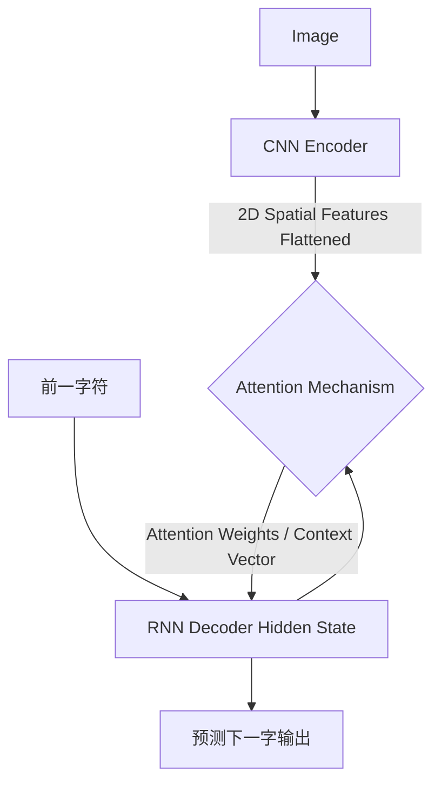

# 架构演进复盘记录：V3 (Seq2Seq + Attention 隐式语言模型)

## 1. 演进动机：打破 CTC 的“不通词意”

在 V2 (CRNN+CTC) 中，我们已经彻底不需要做垂直切分，将整张图做成切片即可让网络自适应寻找特征点。但 CTC 的核心假设是**条件独立性**：即 $y_t$ 切片的输出概率仅和网络在该切片看到的局部特征有关，与 $y_{t-1}$ 输出什么字母毫无关系。
此时 CTC 只认识像素特征，不懂得拼写规则。如果一张图模糊不清，到底是 `O` 还是 `0`？到底是 `1` 还是 `l`？CTC 会选特征最像的那个。

**V3 的宿命**就是来解决语言逻辑。我们要让 OCR 不仅能用眼睛“看图”，还要能用大脑“通读”。

## 2. 核心架构解剖：眼睛与大脑的分工 (`models/seq2seq_attn.py`)

### 部件 1：编码器 (Encoder 的放飞)

在 V3，CNN 抽取出 `4x32` 大小的特征矩阵阵列后将其展开为空间矩阵，且**不再需要对齐**！因为后续有专属注意力对齐网络来接管，所以大大降低了 CNN 骨干的负担。

### 部件 2：注意力通道 (Bahdanau Attention 的凝视)

此网络在每个时间步，都会计算一个由 Decoder 隐状态去主动 Query 生成的 `Attention Map`。
这个权值大小直观反映了在生成当前文字时，AI 认为哪一个原始输入像素片“最有参考价值”，并把提取出的上下文矩阵 (Context Vector) 反馈给大脑。

### 部件 3：解码器 (Seq2Seq Decoder 的背诵)

RNN 获取隐状态，辅以前文记忆 + 正在凝视着的特征，进行自回归翻译。配合特殊字符 `<SOS>` 开始和 `<EOS>` 结束。这迫使它在推断时必须遵守一定的排列语境组装字符。

## 3. UI 交互中的真理可视化

在 V3 `pages/v3_seq2seq_attn.py` 的 Streamlit 推导面板中，我们利用滑块做出了极度迷人的 **“视线游走”** 展台。
将生成的 `Attention Weights` (也就是那张极其扁平的网络焦点向量) 重整并 Alpha 叠底投绘回了原始图片表面：
你可以直接播放它：随着推断字符一个个蹦出，原图上高亮的深红色光晕阵就如同人眼扫视阅读一般紧紧从左跟到了右！

## 4. 痛点遗留：引发 V4 的前奏

- **性能灾难**：Encoder 与 Decoder 完全受制于厚重的 RNN，只能串行慢速前推。
- **对齐漂移 (Drift)**：在面对中间极其留空、背景充满噪点的场景下，Attention 滑动容易找不准特征靶子或者不停倒退，产生了不可控的回转，需要重新唤回一种强有力的辅助去钳制它（CTC + Attn 联合的 V4 双面真谛诞生）。
