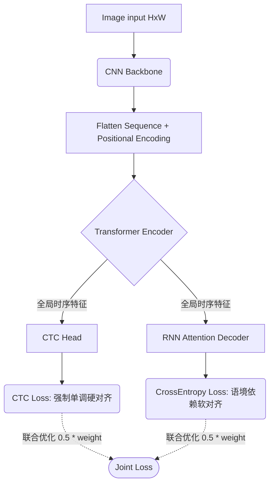

# 架构演进复盘记录：V4 (CNN + Transformer Encoder + CTC & Attention 双头联合)

## 1. 演进动机：解决 V3 的串行瓶颈与对齐失焦

在经历了 V3 版 `Seq2Seq + Attention` 的洗礼后，我们证明了脱离僵硬的“逐帧切割/打标”，引入基于语境的语言模型能极大地提高 OCR 对于规律性字符串（如车牌、日期）的容错率。

但这套基于 RNN/LSTM 的强力机制却暴露出两个致命缺陷：

1. **串行计算灾难**：Encoder 和 Decoder 都有 LSTM/GRU 的身影，这使得时间步长 $T$ 必须等待 $T-1$ 计算完毕，无法发挥并发算力，导致 V3 的训练速度大幅慢于 V2 (CRNN)。
2. **长序列重力漂移 (Alignment Drift)**：完全不受约束的软对齐 Attention机制，当遇到故意拉长图片背景、字距极端分散的情况时，它的“视线”容易发生滑移、甚至在无字区复读。

为此，**V4 是一次为了兼具效率与稳定性而诞生的“混合双轨”架构**。

## 2. 核心架构解剖：三位一体

### 部件 A：抛除 Bi-LSTM，拥抱 Transformer Encoder

V4 舍弃了 V2 和 V3 依赖的 `Bi-LSTM` 序列层。转而将 CNN 所提取出的 $(H \times W \times C)$ 空间特征拉平后，附加位置编码 (Positional Encoding) 作为 $T$ 长度的时间序列，直接大火排量轰入 `Multi-Head Self-Attention` 中。
**优势：** 这使得所有时间切片的特征可以在一层内通过自注意力机制进行全局交流，训练阶段完全并行计算！

### 部件 B：CTC 辅助分支 (保底安全网)

我们在 Transformer 的顶层牵引出一个仅含一层 Linear 的短分支，通过类 V2 的方式，强制令特征步对应 `[Blank, 0-9...]` 的概率分布，并受持 `nn.CTCLoss` 的管控。
**优势：** 它不具备语言属性（条件独立），但它如同**定海神针**。它能通过极其严格的 Blank （全红段块）切断并阻隔没有字的图像区，杜绝特征在此刻随意流动。

### 部件 C：Attention 主路分支 (语言翻译器)

在这个主要推断路线上，我们沿用了 V3 的自回归 `Attention Decoder`，让他踩在 Transformer 提供的高质量、受严控底盘上来吐字。
**优势：** 虽然它依然是一个序列自回归步骤，但由于底盘的特征质量奇高，漂移率大幅下降！

## 3. UI 交互中的验证真谛与教学意义

在 V4 `pages/v4_transformer_joint.py` 中，我们以分栏试图直接在浏览器内同时解剖两种思想：

1. **左路定海图（CTC Thermal Map）**：您能清晰地看到，为了符合现实位置，CTC 毫不犹豫地在数字之间的空隙喷涂代表 `Blank` 的强色带。它在告诉 Transformer Encoder：“这个位置不要有任何输出！”从而死死压制住了漂移。
2. **右路游走图（Attention Map）**：在没有了长距特征滑移的后顾之忧后，注意力模型能精准地回读图像。
3. **全局自注意力（Self-Attention Matrix 32x32）**：折叠在最下端的这个由黄变青的矩阵块，彻底回答了网络底座在这个时空架构中“发生了什么羁绊”。

## 4. 结论与迈向 V5 的前瞻

双重损失 (`Joint Loss`) 的成功回传，证明了兼收并蓄的重要性。这也是从 2019-2021 年各类工业级 OCR Engine (如 Wenet、PP-OCR 迭代) 最为热衷的过渡性方案。

而现在，抛除杂念的主角即将登场：**V5 (Vision Transformer / TrOCR等纯序列原教旨主义者)**！我们将连 CNN 都一并拔除掉，彻底将图像碎为 Patch 拼图，交给 Attention 的算力狂澜去吞噬。
